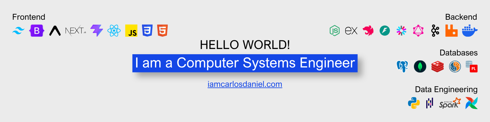
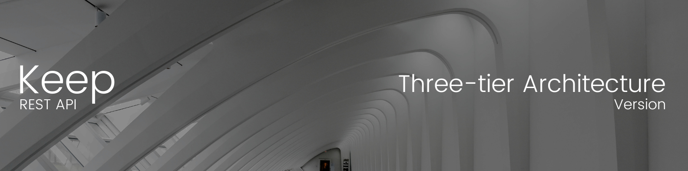

# Hello, I am Carlos Daniel!👋



<div align="center">
  <a href="https://www.linkedin.com/in/iamcarlosdaniel/">LinkedIn</a> &middot;
  <a href="https://www.youtube.com/@iam.carlosdaniel">YouTube</a> &middot; 
  <a href="https://iamcarlosdaniel.com">iamcarlosdaniel.com</a>
</div>

<br/>

Computer Systems Engineering student with a passion for web development, especially in the backend area, and a growing interest in data analysis. I have experience in developing academic, personal, and third-party projects, as well as leading student communities. I stand out for my proactivity, continuous learning ability, and teamwork skills.

I'm looking to apply my skills in a professional setting and connect with other web development experts, mentors, and industry leaders. Feel free to reach out for potential collaborations!

## Featured Projects


[](https://www.npmjs.com/package/amqp-suite)
[](https://opensource.org/licenses/MIT)
[](https://www.npmjs.com/package/amqp-suite)
[](https://github.com/iamcarlosdaniel/amqp-suite)

A simple and efficient AMQP (Advanced Message Queuing Protocol) client wrapper for Node.js that handles connection management, message publishing, and consuming messages from queues with a topic exchange. This package abstracts complex connection handling and simplifies AMQP usage in applications by providing easy-to-use methods for connecting, publishing, consuming, and gracefully shutting down the connection.

```sh
npm install amqp-suite
```

> [!NOTE]
> For more information, visit the official repository of the project. <br/>
> Project repository: [amqp-suite](https://github.com/iamcarlosdaniel/amqp-suite)

---



This API is part of a note-taking application designed with a three-tier architecture. The goal of this application is to provide those who are starting out in software development with a clear understanding of how an application can scale from a three-tier architecture to a microservices-based architecture. I hope you find it very useful.

```sh
git clone https://github.com/iamcarlosdaniel/keep-api-three-tier
```

> [!NOTE]
> For more information, visit the official repository of the project. <br/>
> Project repository: [keep-api-three-tier](https://github.com/iamcarlosdaniel/keep-server-api-three-tier)

---


I want to start by saying that this repository is not like any other. My goal here is to share my experience learning this architecture with Node.js, to assist students who are beginning their journey in software development. I hope it will be of great help to you.

```sh
git clone https://github.com/iamcarlosdaniel/keep-api-microservices
```

> [!NOTE]
> For more information, visit the official repository of the project. <br/>
> Project repository: [keep-api-microservices](https://github.com/iamcarlosdaniel/keep-server-api-microservices)

## Guide for Repository Naming Convention

Aquí tienes una traducción técnica y profesional al inglés, manteniendo el sentido, enfoque y propósito del texto original:

---

In order to standardize software asset identification and ensure project traceability, the following naming convention is established. This structure enables immediate understanding of the domain, responsibility, and technology stack of each repository.

The repository name is constructed using segments separated by hyphens (-), following this hierarchical order:

```
[project_name] - [client/server] - [interface_type] - [architecture] - [stack](optional)
```

- `project_name`: Unique project identifier. Kebab-case must be used (words separated by hyphens).

- `client/server`: Defines the component’s responsibility within the client-server model.

- `interface_type`: Classifies the entry point or nature of the project:
  - `web`: Browser-based applications.
  - `mobile`: Native or hybrid mobile applications.
  - `api`: Backend services (REST, GraphQL, gRPC).
  - `cli`: Command-line interface tools.

- `architecture`: Specifies the predominant architectural pattern to guide developers on code organization:
  - `layered`: Traditional layered architecture.
  - `microservices`: Decoupled component within a distributed ecosystem.
  - `hexagonal`: Ports-and-adapters architecture.

For projects requiring greater granularity, the nomenclature may be extended. If a field is not applicable, the segment is omitted while maintaining logical order:

```
[language/base] - [framework/base_library] - [auth_type] - [database] - [message_broker] - [flag]
```

1. `language/base`: Base programming language (e.g., node, java, python).
2. `framework/base_library`: Primary framework or library (e.g., express, spring, react).
3. `auth_type`: Security mechanism or identity protocol (e.g., jwt, oauth2, firebase).
4. `database`: Primary persistence engine (e.g., postgres, mongodb, redis).
5. `message_broker`: Messaging infrastructure for asynchronous systems (e.g., rabbitmq, kafka).
6. `flag`: Additional metadata or status indicator defined by the technical team (e.g., legacy, poc, v2).

> [!NOTE]
> All fields must be written strictly in lowercase, avoiding special characters or spaces.
