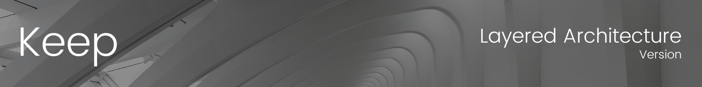
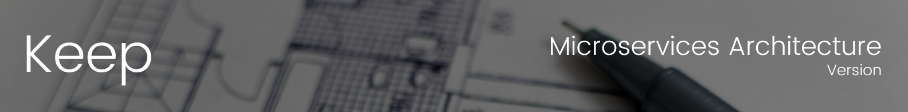

# Hello, I am Carlos Daniel!👋


<div align="center">
  <a href="https://www.linkedin.com/in/iamcarlosdaniel/">LinkedIn</a> &middot;
  <a href="https://www.youtube.com/@iam.carlosdaniel">YouTube</a> &middot; 
  <a href="https://iamcarlosdaniel.com">iamcarlosdaniel.com</a>
</div>

<br/>

Computer Systems Engineer with experience in backend software development and building scalable applications. I have participated in academic, practical, and professional projects, standing out in the design and implementation of architectures, process optimization, and the development of robust solutions in distributed environments. I am seeking opportunities in software development where I can continue to grow and contribute value through solid and scalable technological solutions.

## Featured projects


[](https://www.npmjs.com/package/amqp-suite)
[](https://opensource.org/licenses/MIT)
[](https://www.npmjs.com/package/amqp-suite)
[](https://github.com/iamcarlosdaniel/amqp-suite)

A simple and efficient AMQP (Advanced Message Queuing Protocol) client wrapper for Node.js that handles connection management, message publishing, and consuming messages from queues with a topic exchange. This package abstracts complex connection handling and simplifies AMQP usage in applications by providing easy-to-use methods for connecting, publishing, consuming, and gracefully shutting down the connection.

```sh
npm install amqp-suite
```

> [!NOTE]
> For more information, visit the official repository of the project. <br/>
> Project repository: [amqp-suite](https://github.com/iamcarlosdaniel/amqp-suite)

---



This API is part of a note-taking application designed with a three-tier architecture. The goal of this application is to provide those who are starting out in software development with a clear understanding of how an application can scale from a three-tier architecture to a microservices-based architecture. I hope you find it very useful.

```sh
git clone https://github.com/iamcarlosdaniel/keep-api-three-tier
```

> [!NOTE]
> For more information, visit the official repository of the project. <br/>
> Project repository: [keep-api-three-tier](https://github.com/iamcarlosdaniel/keep-server-api-three-tier)

---



I want to start by saying that this repository is not like any other. My goal here is to share my experience learning this architecture with Node.js, to assist students who are beginning their journey in software development. I hope it will be of great help to you.

```sh
git clone https://github.com/iamcarlosdaniel/keep-api-microservices
```

> [!NOTE]
> For more information, visit the official repository of the project. <br/>
> Project repository: [keep-api-microservices](https://github.com/iamcarlosdaniel/keep-server-api-microservices)

## Repository naming convention

In order to standardize software asset identification and ensure project traceability, the following naming convention is established. This structure enables immediate understanding of the domain, responsibility, and technology stack of each repository.

The repository name is organized into three logical blocks separated by a double hyphen (--). This separation creates a visual hierarchy that allows developers to distinguish between the project's functional identity and its specific technical implementation:

```
[identity_block] -- [stack_block](optional) -- [flag_block](optional)
```

The identity_block is the core of the nomenclature. It is constructed using segments separated by single hyphens (-), following a strict hierarchical order to ensure that related projects are logically grouped and easily identifiable by their primary purpose:

```
[project_name] - [client/server] - [interface_type] - [protocol](optional) - [architecture]
```

- `project_name`: Unique project identifier. Kebab-case must be used (words separated by hyphens).

- `client/server`: Defines the component’s responsibility within the client-server model.

- `interface_type`: Classifies the entry point or nature of the project:
  - `web`: Browser-based applications.
  - `mobile`: Native or hybrid mobile applications.
  - `api`: Backend services (REST, GraphQL, gRPC).
  - `proxy`: Intermediaries for traffic redirection or SSL termination (Reverse Proxies).
  - `gateway`: Entry points for microservices ecosystems (API Gateways).
  - `cli`: Command-line interface tools.

- `protocol`: Specifies the communication or data transfer protocol (Required for api, proxy, and gateway):
  - `rest`, `graphql`, `grpc`, `soap` (Standard APIs).
  - `http`, `tcp`, `udp` (Network/Infrastructure components).
  - `ws` (Real-time communication).
  - `mqtt`, `amqp` (Event-driven or IoT).

- `architecture`: Specifies the predominant architectural pattern to guide developers on code organization:
  - `layered`: Traditional layered architecture.
  - `microservices`: Decoupled component within a distributed ecosystem.
  - `hexagonal`: Ports-and-adapters architecture.

> [!IMPORTANT]
> To improve readability and ensure a clear separation between logical segments, a double hyphen (--) must be used to prefix the stack and flag sections.

> [!TIP]
> An example of this naming convention can be found in the following project: [keep-server-api-layered](https://github.com/iamcarlosdaniel/keep-server-api-layered).

For projects requiring greater granularity, the stack_block acts as a technical specification of the project's implementation. If a field is not applicable, the segment is omitted while maintaining logical order:

```
[language/base] - [framework/base_library] - [auth_type] - [database] - [ORM] - [message_broker]
```

1. `language/base`: Base programming language (e.g., node, java, python).
2. `framework/base_library`: Primary framework or library (e.g., express, spring, react).
3. `auth_type`: Security mechanism or identity protocol (e.g., jwt, oauth2, firebase).
4. `database`: Primary persistence engine (e.g., postgres, mongodb, redis).
5. `ORM`: Data abstraction layer for database interaction via objects (e.g., prisma, hibernate, sqlalchemy).
6. `message_broker`: Messaging infrastructure for asynchronous systems (e.g., rabbitmq, kafka).

> [!TIP]
> An example of this naming convention can be found in the following project: <br />
> [basic-notes-app-layered-javascript-express-jwt-mongodb](https://github.com/iamcarlosdaniel/basic-notes-app-layered-javascript-express-jwt-mongodb).

The `flag_block` provides critical lifecycle metadata or status indicators. This segment ensures that experimental, deprecated, or versioned assets are immediately identifiable without inspecting the repository content:

`flag`: Additional metadata or status indicator (e.g., legacy, poc, v2).

> [!NOTE]
> All fields must be written strictly in lowercase, avoiding special characters or spaces. Consistent with the previous section, a double hyphen (--) must be used to indicate the Flag segment.
