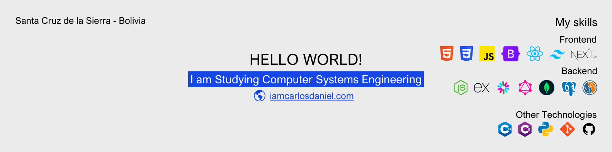

# Hello, I am Carlos Daniel!



Hi, I'm Carlos Daniel, a passionate web development student eager to grow in the digital world. I have solid knowledge of JavaScript, C++, NodeJS, Express, React, MongoDB, MySQL, and Firebase, with a focus on web design and backend development.

Currently studying Computer Systems Engineering at the University of Valle (graduating December 2025), I’m motivated to join a collaborative team where I can contribute my energy and learn from experienced professionals.

I'm looking to apply my skills in a professional setting and connect with other web development experts, mentors, and industry leaders. Feel free to reach out for potential collaborations!

## Convención de nombres en los repositorios

Los repositorios en este perfil están organizados según su propósito. Para facilitar la búsqueda, he establecido una convención de nombres que refleja el enfoque de cada proyecto.

#### 1. Proyectos orientados al aprendizaje

Estos repositorios documentan mi proceso de aprendizaje sobre distintas tecnologías. Sus nombres siguen el siguiente esquema:

<div align="center">
  `project_name - client/server - interface_type - language/base - stack/extra`
</div>

**Ejemplo:**

<div align="center">
  `basic-todo-list - server - api - node - firebase`
</div>

---

#### 2. Proyectos centrados en arquitectura

En este caso, el objetivo es mostrar cómo está estructurado el proyecto desde un punto de vista arquitectónico. No se incluye la tecnología utilizada en el nombre, sino la arquitectura aplicada.

<div align="center">
  `project_name - client/server - interface_type - architecture`
</div>

**Ejemplo:**

<div align="center">
  `keep - server- api - three-tier`
</div>

---

#### 3. Proyectos con enfoque en producción

Estos repositorios están pensados para estar más cerca de un producto terminado. No especifican arquitectura, tecnología ni stack en el nombre, solo el nombre del proyecto.

<div align="center">
  `project_name`
</div>

**Ejemplo:**

<div align="center">
  `the-weather`
</div>

---

## Featured Projects


This API is part of a note-taking application designed with a three-tier architecture. The goal of this application is to provide those who are starting out in software development with a clear understanding of how an application can scale from a three-tier architecture to a microservices-based architecture. I hope you find it very useful.

```sh
git clone https://github.com/iamcarlosdaniel/keep-api-three-tier
```

> [!NOTE]
> For more information, visit the official repository of the project. <br/>
> Project repository: [keep-api-three-tier](https://github.com/iamcarlosdaniel/keep-api-three-tier)

---


I want to start by saying that this repository is not like any other. My goal here is to share my experience learning this architecture with Node.js, to assist students who are beginning their journey in software development. I hope it will be of great help to you.

```sh
git clone https://github.com/iamcarlosdaniel/keep-api-microservices
```

> [!NOTE]
> For more information, visit the official repository of the project. <br/>
> Project repository: [keep-api-microservices](https://github.com/iamcarlosdaniel/keep-api-microservices)
