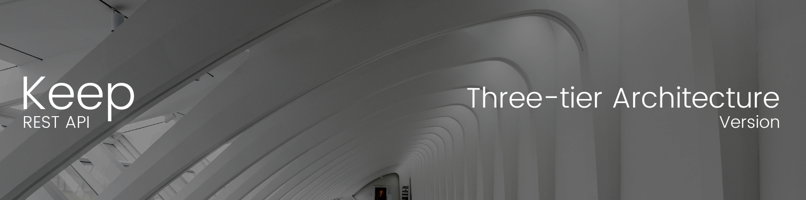

# Hello, I am Carlos Daniel!


Hi, I'm Carlos Daniel, a passionate web development student eager to grow in the digital world. I have solid knowledge of JavaScript, C++, NodeJS, Express, React, MongoDB, MySQL, and Firebase, with a focus on web design and backend development.

Currently studying Computer Systems Engineering at the University of Valle (graduating December 2025), I’m motivated to join a collaborative team where I can contribute my energy and learn from experienced professionals.

I'm looking to apply my skills in a professional setting and connect with other web development experts, mentors, and industry leaders. Feel free to reach out for potential collaborations!

## Naming Convention in the Repositories

The repositories in this profile are organized according to their purpose. To make them easier to find, I’ve established a naming convention that reflects each project’s focus.

#### 1. Learning-Oriented Projects

These repositories document my learning process with different technologies. Their names follow this pattern:


> [!TIP]
> An example of this naming convention can be found in the following project: [basic-todo-list-server-api-node-mongodb](https://github.com/iamcarlosdaniel/basic-todo-list-server-api-node-mongodb).

---

#### 2. Architecture-Focused Projects

In this case, the goal is to showcase the project's structure from an architectural point of view. The name doesn’t include the technologies used, but rather the applied architecture.


> [!TIP]
> An example of this naming convention can be found in the following project: [keep-server-api-three-tier](https://github.com/iamcarlosdaniel/keep-server-api-three-tier).

---

#### 3. Production-Focused Projects

These repositories are focused on solutions that are closer to a production environment. They do not include details about the architecture, technology, or stack in the name, but they do specify whether the project is client-side or server-side, as well as the type of interface used, along with the project name.


> [!TIP]
> An example of this naming convention can be found in the following project: [the-weather-client-web](https://github.com/iamcarlosdaniel/the-weather-client-web).

---

## Featured Projects



This API is part of a note-taking application designed with a three-tier architecture. The goal of this application is to provide those who are starting out in software development with a clear understanding of how an application can scale from a three-tier architecture to a microservices-based architecture. I hope you find it very useful.

```sh
git clone https://github.com/iamcarlosdaniel/keep-api-three-tier
```

> [!NOTE]
> For more information, visit the official repository of the project. <br/>
> Project repository: [keep-api-three-tier](https://github.com/iamcarlosdaniel/keep-api-three-tier)

---


I want to start by saying that this repository is not like any other. My goal here is to share my experience learning this architecture with Node.js, to assist students who are beginning their journey in software development. I hope it will be of great help to you.

```sh
git clone https://github.com/iamcarlosdaniel/keep-api-microservices
```

> [!NOTE]
> For more information, visit the official repository of the project. <br/>
> Project repository: [keep-api-microservices](https://github.com/iamcarlosdaniel/keep-api-microservices)
